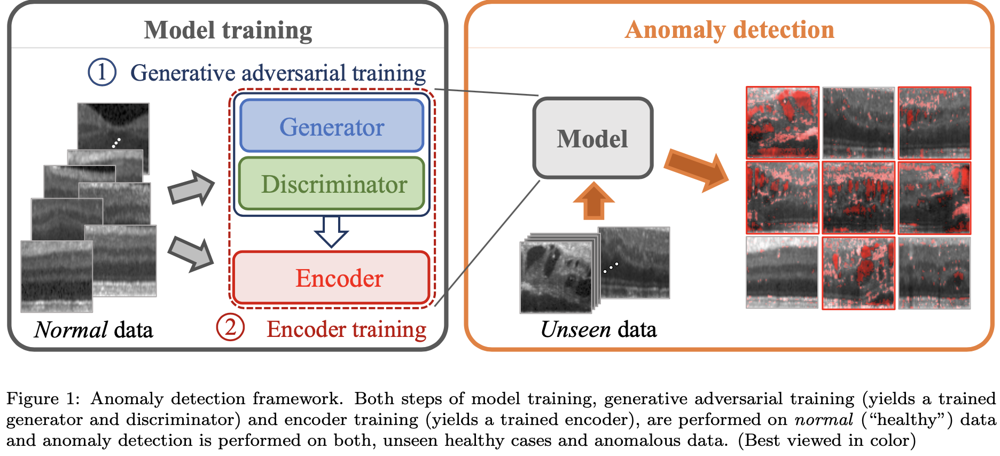
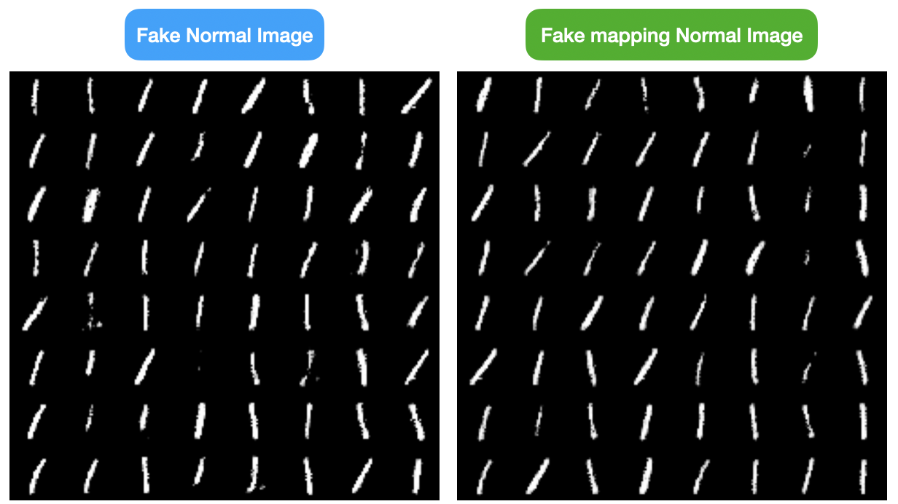
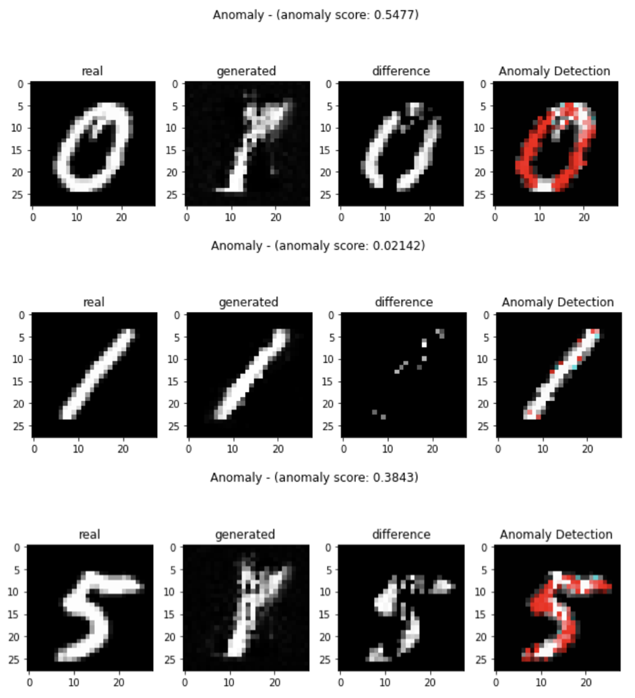
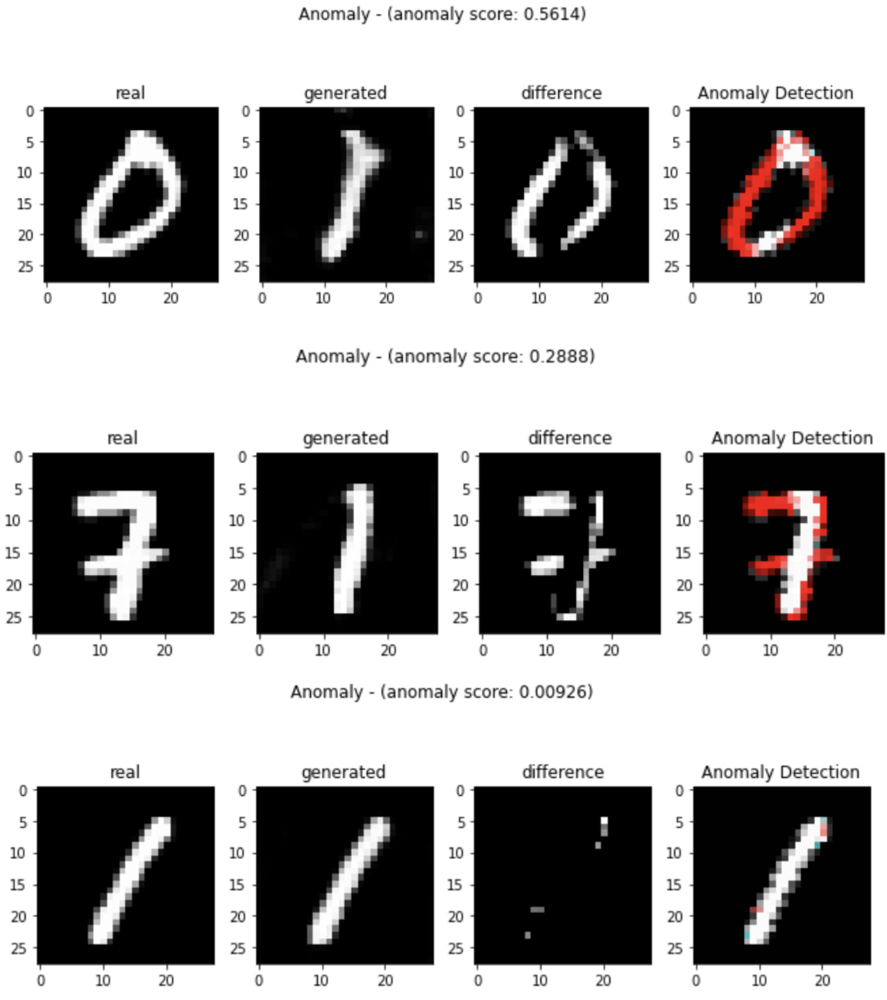
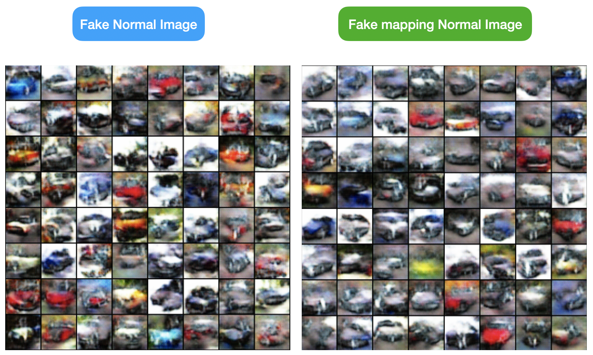
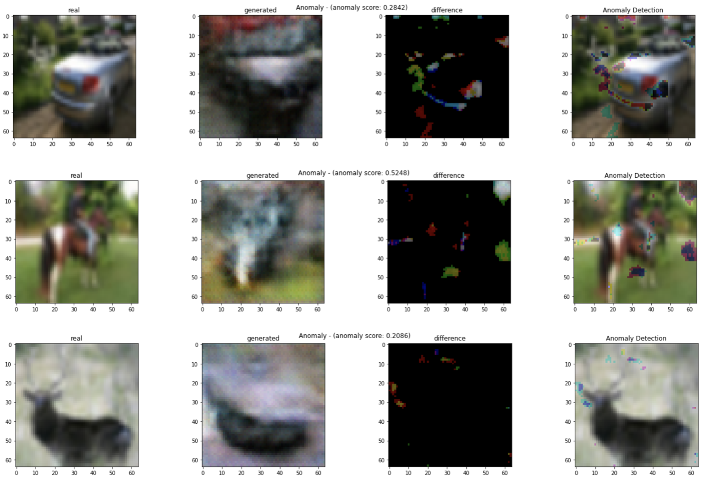

# f-AnoGAN: Fast Unsupervised Anomaly detection with GAN using Pytorch

## Abstract

paper link : https://www.sciencedirect.com/science/article/abs/pii/S1361841518302640

**[문제점]**

정확한 annotation은 시간이 많이 들기 때문에 clinical imaging에서 전문가가 직접 annotation을 표시한 데이터를 얻는 것은 어렵다. 또한 모든 병변에 대해 제대로 표시되지 않을 수도 있으며 annotation에 대해서도 정확하기 이 병변이 어떤 병변인지 정확한 설명이 되어있지 않은 경우도 있다.

**[Supervised Learning의 장단점]**

전문가로부터 분류된 training data를 상요할 수 있는 경우 Supervised Learning이 좋은 결과를 얻는 반면, annotation이 표시된 병변으로만 제한이 된다.

**[Unsupervised Learning으로 접근한 f-AnoGANd을 제안함]**

본 논문에서는 biomarker candidates를 할 수 있는 anomalous images 및 image segments를 식별할 수 있는 GAN 기반 Unsuperviswd Learning 접근법인 f-AnoGAN(fast AnoGAN)을 제안한다.

**[fast mapping technique of new data]**

우리는 normal data로 Generator model을 학습 시키고 GAN의 latent space에 query data의 fast mapping technique를 제안하고 평가한다.
mapping 방법은 Encoder를 기반으로 하며, Discriminator feature redidual error 및 image reconstruction error G(z)를 포함하는 훈련된 모델을 기반으로 anomaly score를 통해 anomaly detection이 진행된다.

Optical Coherence Tomography(OCT) 촬영 데이터에 대한 실험에서 본 논문에서는 제안된 방법을 대체 접근법(AnoGAN, BiGAN etc.)과 비교하고 성능을 뛰어 넘어 Anomaly Detection의 정확도를 높인다는 포괄적인 경험적인 증거를 제공한다. 또한 두 명의 망막 전문가를 대상으로한 시각적 테스트 결과 generation된 이미지가 실제 망막 OCT 이미지와 잘 구별이 안되는 것으로 나타냈다.

## Code contents
###   Auto Encoder & VAE  

🗣AE와 VAE의 Encoder 사용한 코드들을 순차적으로 정리할 예정입니다.
- ✔️ f-AnoGAN MNIST(GAN + AutoEncoder) with Pytorch (using Tensorboard)
- ✔️ f-AnoGAN MNIST(DCGAN + AutoEncoder) with Pytorch (using Tensorboard) 
- f-AnoGAN CIFAR-10 (GAN + AutoEncoder) with Pytorch (using Tensorboard) [업로드 예정] 
- f-AnoGAN CIFAR-10 (DCGAN + AutoEncoder) with Pytorch (using Tensorboard) [업로드 예정] 
- f-AnoGAN CIFAR-10 (GAN + VAE) with Pytorch (using Tensorboard) [업로드 예정] 
- f-AnoGAN CIFAR-10 (DCGAN + VAE) with Pytorch (using Tensorboard) [업로드 예정] 
- f-AnoGAN CelebA with Pytorch (using Tensorboard) 👉***High Resolution*** [업로드 예정]
- f-AnoGAN CelebA-HQ with Pytorch (using Tensorboard) 👉***High Resolution*** [업로드 예정]

## Result
### 1. GAN + AutoEncoder - MNIST

</pr>

### 2. DCGAN + AutoEncoder - MNIST

### 3. DCGAN + AutoEncoder - CIFAR-10

- 문제점 : DCGAN으로만 학습을 할때 좋은 퀄리티가 나올 때 가지 학습이 잘 안됨, 그래서 Fake Image를 만들게 되더라도 흐릿한 이미지를 만들게되서 Anomaly Detection이 잘 이루어지지 않음. [AUC : 0.4396]
- 해결책 : DCGAN 보다 안정적으로 학습을 하는 모델을 사용 (ex, PGGAN, WGGAN etc.)
- ⭐️AutoEncoder를 사용해서 Mapping이 비교적 제대로 이루어짐.

### 4. DCGAN + VAE - CIFAR-10

## Reference

- [tSchlegl/f-AnoGAN: Code for reproducing f-AnoGAN training and anomaly scoring](https://github.com/tSchlegl/f-AnoGAN)
- [PyTorch-GAN/wgan_gp.py at master · eriklindernoren/PyTorch-GAN](https://github.com/eriklindernoren/PyTorch-GAN/blob/master/implementations/wgan_gp/wgan_gp.py)
- [A03ki/f-AnoGAN](https://github.com/A03ki/f-AnoGAN)
